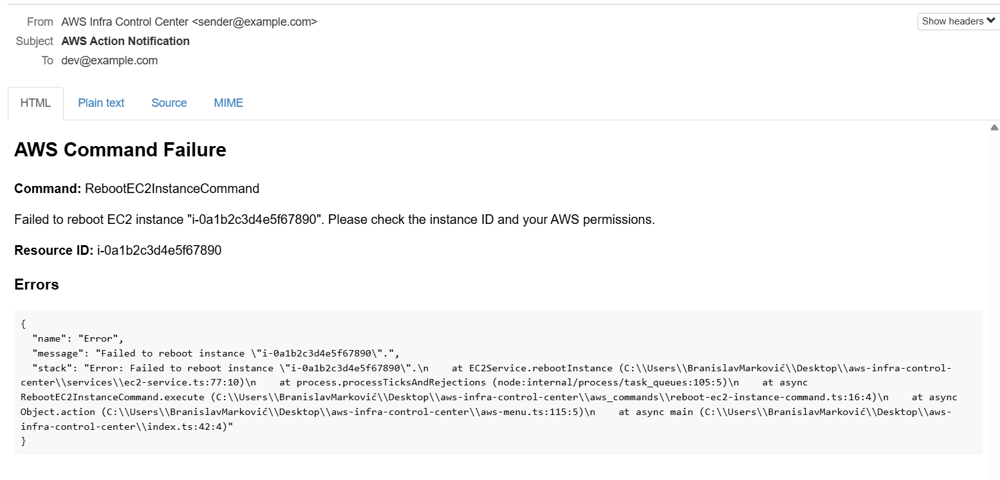
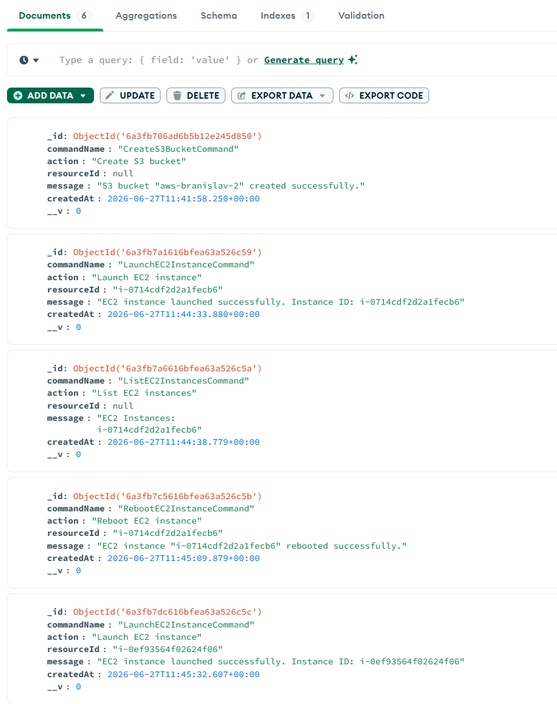

# AWS CLI Tool (TypeScript/Node.js)

A simple CLI application built with TypeScript, Node.js and AWS SDK v3 for managing AWS resources from the terminal.

## Features

### EC2
- Launch a new EC2 instance
- List all EC2 instances
- Delete an EC2 instance
- Reboot an EC2 instance

### S3
- Create a new S3 bucket
- Delete an S3 bucket

---

# Tech Stack

- TypeScript
- Node.js
- MongoDB
- Redis
- AWS SDK v3
- BullMQ
- Mailhog
- Docker Compose
- Zod (input validation)
- Winston (logging)
- Biome (formatting/linting)

---

# Project Structure

```bash
├── aws_commands/
├── config/
├── docs/
├── emails/
├── factories/
├── interfaces/
├── logs/
├── models/
├── queues/
├── services/
├── tests/
├── workers/
└── index.ts
```

### Architecture

The project follows a simple layered architecture:

- `index.ts`
  - CLI entry point
  - Handles menu rendering and user input

- `services/`
  - Contains AWS business logic

- `factories/`
  - Responsible for service creation and dependency injection

- `config/`
  - AWS configuration

- `docs/`
  - Documentation assets like screenshots

- `emails/`
  - Email templates and content generation

- `logs/`
  - Application logging output

- `models/`
  - Database and audit models

- `queues/`
  - Queue configuration and exports

- `workers/`
  - Background job processors (email worker)

---

# Prerequisites

- Node.js >= 20
- AWS Account
- Configured AWS credentials

---

# AWS Credentials

Configure credentials using AWS CLI:

```bash
aws configure
```

Or export environment variables:

```bash
export AWS_ACCESS_KEY_ID=your_key
export AWS_SECRET_ACCESS_KEY=your_secret
export AWS_REGION=your_region
```

---

# Installation

Clone the repository:

```bash
git clone https://github.com/branislav-markovic/aws-infra-control-center.git
cd <project-name>
```

Install dependencies:

```bash
npm install
```

---

# Configuration

Update AWS configuration inside:

```bash
config/aws.config.ts
```

Example:

```ts
export const awsConfig = {
    region: 'eu-central-1',
    amiId: 'ami-xxxxxxxxxxxxx',
};
```

---

# Running the Application

The app requires Redis and the email worker to be running.

```bash
docker compose up -d
npm run email-worker
```

Development mode:

```bash
npm run dev
```

Run compiled version:

```bash
npm start
```

---

# Example Menu

```bash
AWS CLI Menu:

0. ❌ Exit
1. 🚀 Launch new EC2 Instance
2. 📋 List all EC2 Instances
3. 📦 Create new S3 Bucket
4. 🗑️  Delete S3 Bucket
5. 🗑️  Delete EC2 Instance
6. 🔄 Reboot EC2 Instance
```

---

# Example Output

## Launch EC2 Instance

```bash
i-0123456789abcdef0
```

## List EC2 Instances

```bash
i-0123456789abcdef0
i-0fedcba9876543210
```

## Create S3 Bucket

```bash
Bucket "my-bucket" created successfully.
```

## Delete S3 Bucket

```bash
Bucket "my-bucket" deleted successfully.
```

## Delete EC2 Instance

```bash
Instance "i-0123456789abcdef0" terminated successfully.
```

## Reboot EC2 Instance

```bash
Instance "i-0123456789abcdef0" rebooted successfully.
```

## Email failure payload example

```json
{
  "message": "Failed to launch EC2 instance. Please check your AWS configuration and permissions.",
  "command": "LaunchEC2InstanceCommand",
  "resourceId": null,
  "error": {
    "name": "CredentialsProviderError",
    "message": "Could not load credentials",
    "stack": "..."
  }
}
```



## MongoDB audit record example

```json
{
  "commandName": "CreateS3BucketCommand",
  "action": "Create S3 bucket",
  "resourceId": "my-bucket",
  "message": "S3 bucket \"my-bucket\" created successfully.",
  "createdAt": "2026-06-27T13:55:58.000Z"
}
```



---

# Learning Goals

This project was built for practicing:

- TypeScript
- AWS SDK v3
- Dependency Injection
- Factory Pattern
- Command Pattern
- CLI application architecture
- Queue-driven error handling with BullMQ
- MongoDB audit logging
- Clean code principles

---

# License

MIT